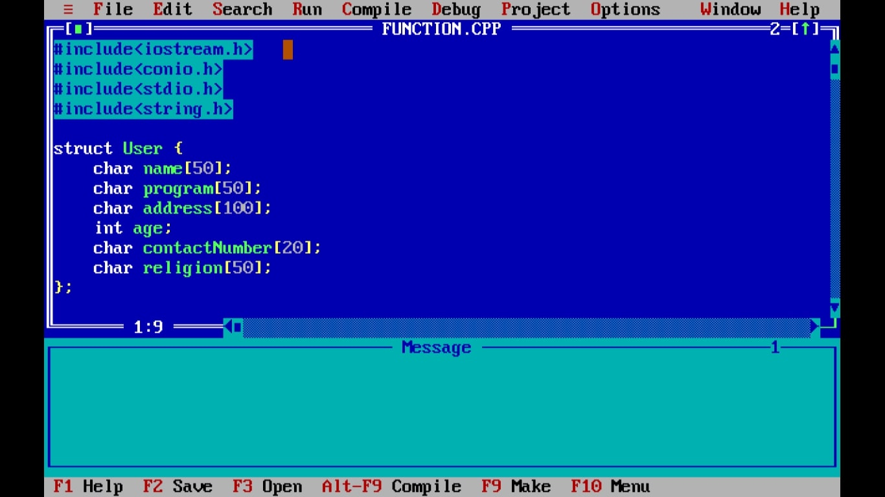
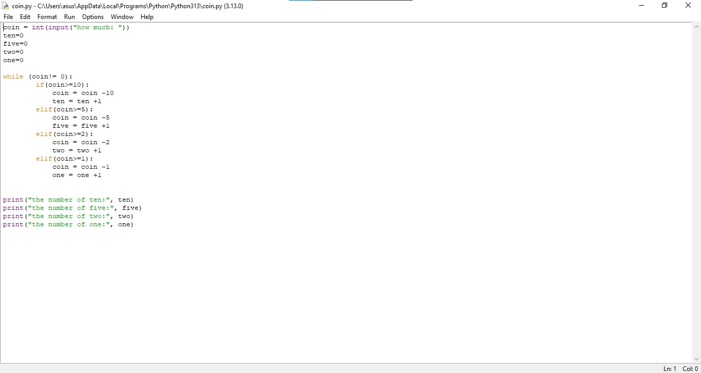
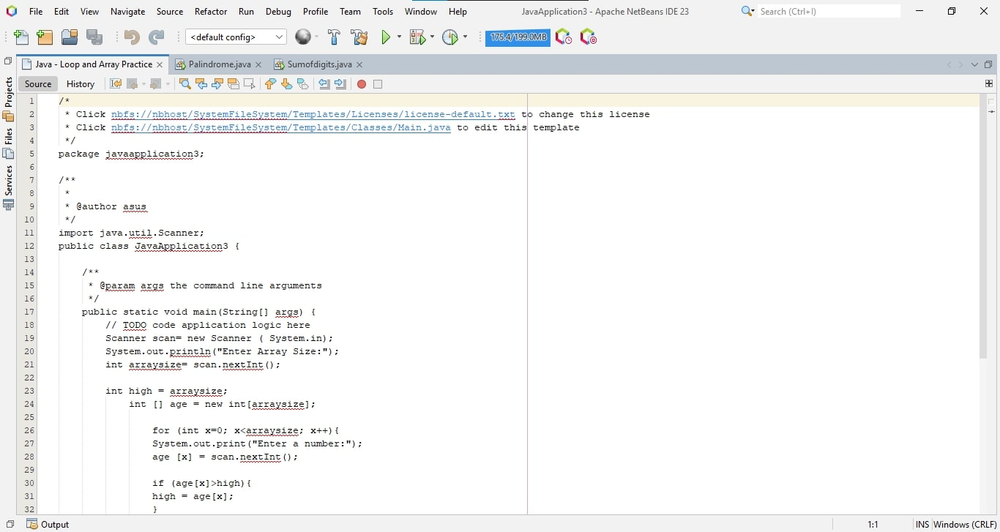
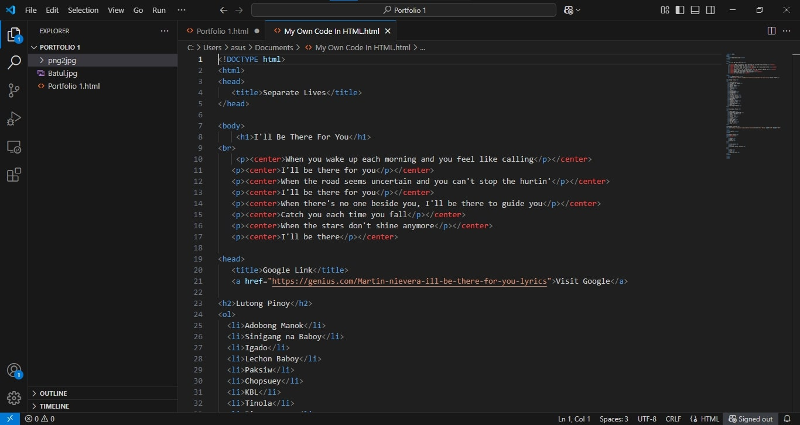

<html lang="en">
<head>
    <meta charset="UTF-8">
    <meta name="viewport" content="width=device-width, initial-scale=1.0">
    <title>My Profile</title>
    
</head>
<body>

    

        
    

    <h1>My Profile</h1>

    

        <h2>💫 About Me:</h2>
        
Name: Serolf H. Flores

        
Age: 21

        
Birthday: July 18, 2003

        
Contact Number: 09512185146

        <h3>EDUCATIONAL BACKGROUND</h3>
        
Graduated from Amaya Elementary School (2008-2014) 
           Graduated from Amaya School of Home Industries (2015-2019) 
           Graduated from Tanza National Comprehensive High School (2019-2021) 
           Currently studying at Cavite State University CCAT Campus in Bachelor of Science in Information Technology (2022) 
           Captain of Badminton Men Varsity (2023-2025)

        <h3>SKILLS</h3>
        <ul>
            <li>Cooperative in every aspect.</li>
            <li>Approachable and good at socializing.</li>
            <li>Obedient and with integrity.</li>
            <li>Hardworking and patient.</li>
            <li>Good at designing and coloring either physical or digital.</li>
        </ul>
        <a href="https://github.com/SerolfloreS" class="button">View My GitHub</a>
    

    

        <h2>🌐 Socials:</h2>
        <a href="https://facebook.com/https://www.facebook.com/share/1HxE8evGmj/">Facebook</a> |
        <a href="https://instagram.com/seroplanongpapel">Instagram</a> |
        <a href="https://tiktok.com/@IsiahGabrielleBatul">TikTok</a> |
        <a href="mailto:serolfhazflores@gmail.com">Email</a>
    

    

        <h2>💻 Tech Stack:</h2>
        
HTML5, Adobe Photoshop, Turbo C++, Python, Java, MySQL Database, XML, CMD, Linux

        <a href="https://www.codecademy.com/learn/learn-html" class="button">Learn HTML</a>
        <a href="https://www.adobe.com/africa/learn/photoshop" class="button">Learn Adobe Photoshop</a>
        <a href="https://www.mygreatlearning.com/academy/learn-for-free/courses/turbo-c" class="button">Learn Turbo C++</a>
        <a href="https://www.learnpython.org/" class="button">Learn Python</a>
        <a href="https://www.codecademy.com/learn/learn-java" class="button">Learn Java</a>
        <a href="https://www.w3schools.com/MySQL/default.asp" class="button">Learn MySQL Database</a>
        <a href="https://www.w3schools.com/xml/" class="button">Learn XML</a>
        <a href="https://www.codecademy.com/learn/learn-the-command-line" class="button">Learn CMD</a>
        <a href="https://linuxjourney.com/" class="button">Learn Linux</a>
    

    

        <h2>📊 GitHub Stats:</h2>
        
        
        
    

    

        <h2>🏆 GitHub Trophies</h2>
        
    

    

        <a href="https://visitcount.itsvg.in/api?id=SerolfloreS&icon=7&color=3">Visit Count</a>
    

    

        <h2>Dummy Projects</h2>
        <ul>
            <li>Turbo C++</li>
            
            <li>Python</li>
            
            <li>Java</li>
            
            <li>HTML</li>
            
        </ul>
    

</body>
</html>
